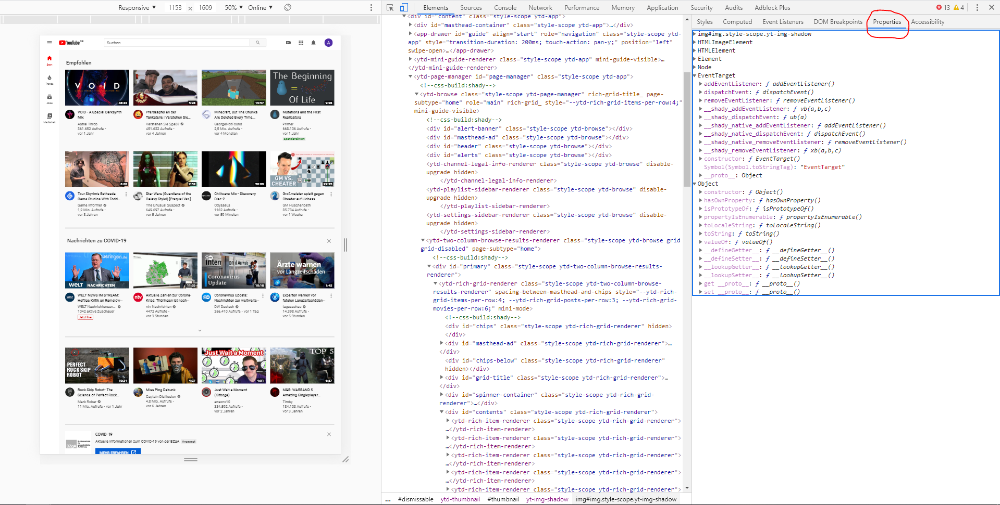
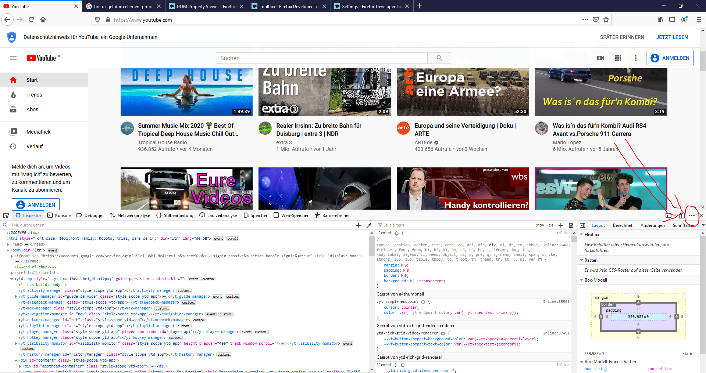

## **3 _Juni_** Typescript und Javascript

*[direkt zur Praktikumsaufgabe](#a--praktikumsaufgabe)*
*[direkt zu Q&A](#-qa-fragen-und-antworten)*


### Rückblick auf das DOM
Lädt der Browser eine Datei und versucht diese als HTML-Datei zu interpretieren, baut er anhand der Daten im Speicher ein Document-Object-Modell (DOM) auf. Was schließlich im Browserfenster angezeigt wird ist also nicht ein direktes Abbild der Datei, sondern ein Abbild dieses internen Speichermodells.
- [x] Erzeugen Sie eine einfache Textdatei mit der Endung ".txt" im Dateinamen und schreiben Sie einige Worte hinein, auch mit mehreren Leerzeichenfolgen, Umlauten und Tabulatoren. Laden Sie diese Datei im Browser und schauen Sie sich in den Entwicklertools die Seitenstruktur an (Tab links neben Console)   

Es wird deutlich, dass ein `html`-Element enstanden ist und darin ein `head`-Element sowie ein `body`-Element. In letzterem ist irgendwo, wahrscheinlich in einem `pre`-Element, unser eigentlicher Text vergraben.
- [x] Ändern Sie die Endung in ".html" und lade die Datei erneut. Was hat sich verändert?

### DOM-Manipulation
Ein Skript kann das DOM manipulieren, darin Elemente verändern, hinzufügen oder löschen, der Browser kümmert sich automatisch um die Darstellung für den User. 

>**Achtung:** Die Begriffe Objekt, Element und Knoten können teilweise synonym verwendet werden, es ist aber Vorsicht geboten. 'Alles' in Javascript/TypeScript ist Objekt, auch etwas vom Typ `number` oder `string`. Ein Knoten ist ein Objekt mit speziellen Eigenschaften und Fähigkeiten, mit dem sich ein Graph aufbauen lässt. Ein Element wiederum ist ein spezieller Knoten, der Eigenschaften eines HTML-Elementes aufweist.
- [x] Inspizieren Sie das DOM-Klassenhierarchie Schaubild:


### Baumstruktur
Das DOM lässt sich, wie auch z.B. die Aktivitätsdiagramme, als Graph mit Knoten, die mit Kanten verbunden sind, darstellen.
- [x] Suchen Sie die Klasse `Node` im Schaubild zur DOM-Hierarchie. Welche verwandtschaftlichen Beziehungen werden innerhalb der Klasse genutzt?  

Diese Knoten enthalten die Kernfunktionalität zur Bildung des Graphen und damit des DOMs. Jeder Knoten kann auf einen anderen Knoten als `parentNode` verweisen und auf eine Liste von `childNodes`. Im DOM ist `document` der Wurzelknoten, der lediglich eine Referenz auf `html` in seiner Kinderliste hat. `html` referenziert über die Eigenschaft `parentNode` das `document` und hat in seiner Kinderliste Referenzen auf `head` und `body`. `body` wiederum referenziert `html` als Mutter bzw Vater und hat wieder verschiedene Kindreferenzen, je nach Inhalt der darzustellenden Seite. Damit ergibt sich eine Baumstruktur, die sich in der Tiefe immer weiter verästeln kann und mit Hilfe der Entwicklertools, wie oben bereits getan, leicht einsehen lässt.
- [x] Wählen Sie sich für ein besseres Verständnis des DOM aus Ihren eigenen vorangegangenen Arbeiten eine Seite aus und stellen Sie deren DOM grafisch dar.

## Dom Untersuchen:

Sie können das DOM untersuchen & sich dessen Eigenschaften ausgeben lassen: 

### Dom in Chrome untersuchen: 



### Dom in Firefox untersuchen: 




## Ereignisse
Das DOM bietet zudem ein System für die Interaktion mit dem Nutzer: das Eventsystem. Es stellt äußerst bequem Informationen zu Ereignissen innerhalb der Anwendung zur Verfügung, ohne dass Kenntnisse der Hardware erforderlich sind. Das Betriebssystem und der Browser werten diese Ereignisse bereits aus und bringen die Informationen darüber in eine allgemeine Form.

### Event-Objekt
Events sind spezielle Objekte, die Informationen über ein Ereignis
tragen. Ein solches Ereignis kann ein Mausklick sein, ein Tastendruck, eine Berührung des Bildschirms, das Laden einer Datei oder die Beendigung einer Datenübertragung und vieles mehr.
- [x] Im DOM-Klassendiagram sind einige Ereignisklassen aufgeführt. Finden Sie sie und heraus, welche Informationen diese tragen.

## Kurze Zusammenfassung von Events:
<video controls width="100%"> 
    <source src="https://lehre.gabriel-rausch.de/HFU/EIA1_SoSe20/L06/L06_03_Events.mp4" type="video/mp4"> 
    <a href="https://lehre.gabriel-rausch.de/HFU/EIA1_SoSe20/L06/L06_03_Events.mp4">Zum Video</a>
</video>

### Target
In der Regel bezieht sich ein Ereignis auf ein bestimmtes Objekt. Zum Beispiel auf den Button, der angeklickt wurde, den Link, der berührt wurde, das Fenster, das den Ladevorgang abgeschlossen hat oder das Textfeld, das verändert wurde. Die Eigenschaft `target` des Event-Objektes stellt eine Referenz auf dieses Ziel-Objekt zur Verfügung.
- [x] Von welchem Typ ist `target`? schauen Sie im Klassendiagramm...
- [x] Objekte welcher Klassen können also `target`s sein? 

### Type
`type` ist eine simple Zeichenkette und gibt an, was für ein Ereignis beschrieben wird. Hier sind beispielsweise die Werte `click`, `load`, `change`, `dragstart` und viele weitere vordefiniert. Es ist aber auch möglich eigene, neue Ereignisse zu definieren.  
- [x] Recherchieren Sie mehr. Finden Sie heraus, welche Arten von Events der Browser zur Verfügung stellt!

## Event-Handler
Handler sind Funktionen, die ein Ereignis auswerten. Der Umgang damit ist denkbar simpel.

### Handler-Implementation
Um ein Ereignis auszuwerten, implementieren Sie einfach eine Funktion, deren Signatur diesem Muster entspricht:
```typescript
function handlerName(_event: Event): void {
    ...
}
```
Die Funktion nimmt also einen Parameter vom Typ `Event` entgegen, im Beispiel trägt dieser Parameter den Namen `_event`. Auch der Name der Funktion ist frei wählbar, es ist aber zu empfehlen den Prefix "handle" oder abgekürzt "hnd" zu verwenden, z.B. "handleClick", denn eine solche Funktion, die ein Event verarbeitet, nennt man Handler.

### Listener-Installation
Damit das System weiß, bei welchem Ereignis welcher Handler aufgerufen werden soll, muss der Handler registriert werden. Dies erfolgt mit der Anweisung `addEventListener(...)`, zum Beispiel so:
```typescript
document.addEventListener("click", handleClick);
```
Der erste Parameter ist lediglich die Zeichenkette, die den Typ des Ereignisses beschreibt, der zweite eine Referenz zum Handler. Erhält das document-Objekt nun ein Event-Objekt vom Typ "click", wird dieses an die Handler-Funktion `handleClick` weitergeschickt. Das `document`-Objekt horcht also jetzt in das System hinein, es wurde ihm hierfür ein "Ohr" installiert, ein sogenannter Listener.
>**Achtung:** Ein häufiger Fehler in Javascript ist, statt der Referenz einen Funktionsaufruf zu implementieren, z.B. mit `addEventListener("click", handleClick())`. Die zusätzliche Klammer bewirkt, dass die Funktion bereits bei der Installation aufgerufen wird und deren zurückgeliefertes Ergebnis als Handler-Referenz installiert wird.

### Beispiel
Das Folgende dürfte das wohl primitivste Beispiel sein, dass wir mit dem Eventsystem darstellen können.
```typescript
namespace L02_Load {
    window.addEventListener("load", handleLoad);

    function handleLoad(_event: Event): void {
        console.log(_event);
    }
}
```
Hiermit wird das `window`-Objekt, welches dem Browsertab entspricht in dem die Applikation läuft, angewiesen, die Funktion handleLoad aufzurufen, wenn ein "load"-Event ankommt, und ihr das zugehörige `event`-Objekt zu übergeben. `handleLoad` sorgt dann lediglich für die Darstellung des Objektes in der Konsole.
- [x] Untersuchen Sie das ausgegebene `event`-Objekt
- [x] Recherchieren Sie nach dem `load`-Event, wann genau wird es ausgelöst? Was ist der Unterschied zu `DOMContentLoaded`?
- [x] Installieren Sie den Listener am `document`-Objekt, statt am `window`-Objekt. Was geschieht nun?
- [x] Experimentieren Sie in der gleichen Form mit `DOMContentLoaded`, wie verhält sich das System nun?

## Event-Phasen
Nicht alle Ereignisse werden allen Objekten im System mitgeteilt. Es ist also nur sinnvoll dort Listener zu installieren, wo sie auch wirken können. Besonders interessant wird das Ganze bei Nutzerinteraktionen, die auf DOM-Objekten ausgeführt werden, wie beispielsweise der Klick auf einen Button. Solche Ereignisse werden nämlich in drei Phasen durch den DOM-Graphen durchgereicht.

### Phase 1: Capture
Das Event-Objekt wird zunächst an das `window` übergeben. Von dort wandert es zum `document`, zum `html`, zum `body` und weiter in den Baum in Richtung des `target`.
### Phase 2: Target
Wenn es vom Elternobjekt zum `target` gereicht wird, befindet sich das Event-Objekt in der Target-Phase.
### Phase 3: Bubble
Schließlich steigt das Event-Objekt im Baum wieder auf, bis es erneut das `window` erreicht. Es steigt also wie eine Luftblase unter Wasser an die Oberfläche.

### Listener-Options
Bei der Installation des Listeners können mit einem dritten Parameter noch Informationen zur Funktionsweise mitgegeben werden. Wird hier schlicht ein `true` mitgegeben, reagiert der Listener auf die Capture-Phase. Ansonsten, was üblicher ist, auf die Bubble-Phase. In jedem Fall reagiert er auf die Target-Phase.

### CurrentTarget
Neben dem `target` trägt das Event-Objekt auch noch eine Referenz auf das Objekt, dessen Listener das Ereignis als letztes gehört hat. Mit `currentTarget` kann also ausgewertet werden, wo sich das Ereignis gerade im DOM befindet und bearbeitet wird.

### Path
Den kompletten Pfad, den das Event durch das DOM nimmt, kann man im Attribut `path` einsehen oder per Skript durch die Methode `composedPath()` ermitteln.

### Beispiel
- [x] Untersuchen Sie die Seite [Phases](https://jirkadelloro.github.io/EIA2-Inverted/X00_Code/L02_Events/Phases/) und lassen Sie den Code laufen.
- [x] Was geschieht bei einem Klick auf den Button, bei einem Klick rechts daneben und bei einem Klick darunter? Warum?

## Takeaways

Sie haben gelernt:

- Wie Events in TypeScript funktionieren
- Wie die Phasen von Events verlaufen
- Wie Events registriert werden können
- Wie Eventhandling funktioniert
- Wie die DOM Klassenhierarchie aufgebaut ist 
- Wie DOM & Events zusammenhängen

### Typescript Dokumentation

https://www.typescriptlang.org/

## **A _---_** Praktikumsaufgabe

>**Bei Problemen/Unklarheiten:** können Sie ins Praktikum kommen oder per Discord/Mail fragen stellen.

Erstellen Sie ein neues Verzeichnis und kopieren Sie die Files der Letzten Aufgabe hinein. 

Die Aufgabe baut auf der Shop Aufgabe der letzten 2 Wochen auf. 

>**Empfehlung:** Sorgen Sie dafür, dass es nur 1 Shopseite mit allen Artikeln gibt, da Sie andernfalls auf allen Seiten auf denen Produkte angezeigt werden die Kriterien der Aufgabe 1 & Aufgabe 2 erfüllen müssen. 

Ziel der Praktikumsaufgabe ist es mithilfe von Events den Usern Ihres Shops eine bessere Interaktion mit der Website zu ermöglichen.

## Teilaufgabe 1:

Registrieren Sie einen Klick-Event-Listener der die Maus-/Toucheingabe eines Users auf einen der Kaufen-Buttons detektiert. Beim Klick auf einen der Kaufen-Buttons soll über/neben dem Warenkorb (Der Warenkorb **muss sichtbar bleiben**) z.B. in einem Kreis die anzahl der geklickten Artikel angezeigt werden. Bei 0 Artikeln ist nichts sichtbar.

### Beispiele aus echten Shops:


Berechnen Sie die Summe aller angeklickten Artikel und geben sie diese in der Konsole aus. 

>**Anmerkung:** Ggf. müssen Sie Ihr Artikel-Interface aus der vorherigen Aufgabe so anpassen, dass der Preis nicht als String sondern als number gespeichert wird.

## Teilaufgabe 2:

Anstelle von Sprungmarken die Nutzer zu einer jeweiligen Kategorie bringen, sollen in der Navigationsleiste/Headdermenü/Hauptmenü per Klick-Event-Listener alle Arikel der "falschen" Kategorie ausgeblendet werden, sodass ausschließlich alle Artikel der geklickten Kategorie übrig bleiben. Des weiteren soll eine Option in der Navigationsleiste/Headdermenü/Hauptmenü ebenfalls per Klick-Event-Listener alle Artikel wieder einblenden.

>### **Achtung!:** Beachten Sie die [<ins>Coding Style Guidelines</ins>](https://hs-furtwangen.github.io/GIS-SoSe-2020/codingstyle/). Code der diesen Guidelines nicht entpricht wird nicht akzeptiert! Code der W3 Errors oder JS-Errors aufweist wird ebenfalls nicht akzeptiert! Verstöße fürhen zu einer Ampelstufe 🚦

## Bonusaufgabe (nicht pflicht):

Informieren Sie sich über RegEx & implementieren Sie in der Navigation eine Suchleiste die mithilfe von RegEx nach matches sucht. Blenden Sie alle Items aus in der weder in der Beschreibung/Titel eines Artikels ein Match gefunden wurde.

### Sowie Freiwillige TypeScript Übungsaufgaben
[Übungsaufgaben mit Fokus auf Konsolenausgaben zum Selbststudium](https://github.com/Plagiatus/EIA/blob/master/Aufgaben.md) mit Lösungen. (Diese Aufgaben wurden ursprünglich für das Ende von EIA1 konzipiert um sich auf EIA2 vorzubereiten, stellen aber allgemein eine gute Ressource zum Selbststudium dar, inklusive einfacher Aufgaben zur Wiederholung als auch sehr komplizierte Aufgaben. _Keine offizielle Aufgabe, lediglich als Bonusmaterial wenn Sie Zeit und Lust haben noch etwas mehr zu üben!_)

### **Abgabetermin: 07.06.2020 um 18:00 auf der Kursseite!**

Bitte erstellen Sie nach Fertigstellung einen Link als oberstes Element (unter dem GitHub issues link) in Ihrer Steckbrief.htm, der auf das Ergebnis verweist (bspw. nutzername.github.io/GIS-SoSe-2020/Aufgabe_6).

>### **Achtung!:** Eine fehlerhafte Abgabe fürt zu einer 🚦 die **im Praktikum** verteidigt werden muss. Keine Abgabe zu 2 🚦 von denen nur 1e 🚦 verteidigt werden kann.

---

## **?! _<small>Q&A</small>_** Fragen und Antworten

(die Publikation der Zusammenfassung erfolgt nach dem Q&A Termin)

Zusammenfassung von: [&lt;GitHub Nutzername&gt;](https://github.com/link-zu-github-profil)

### Erste Frage?
LoremLabore labore cillum mollit pariatur reprehenderit dolor laboris reprehenderit dolor sit officia ea non. Lorem reprehenderit exercitation labore eiusmod aute do nostrud officia aute proident sunt. Labore non tempor aliqua voluptate. Exercitation culpa officia ut aliqua nostrud laborum irure est. Minim eu sunt culpa adipisicing laborum consectetur aliqua quis.

### Zweite Frage?
Mollit aliquip veniam sit eiusmod tempor anim ipsum tempor. Aliqua sunt voluptate ea dolor. Nulla est mollit consectetur cupidatat ut cillum ipsum minim. Est ex et nulla laborum fugiat dolore. Aliquip laboris sint exercitation commodo dolor sint mollit qui sunt ipsum fugiat occaecat id enim.

## ...
